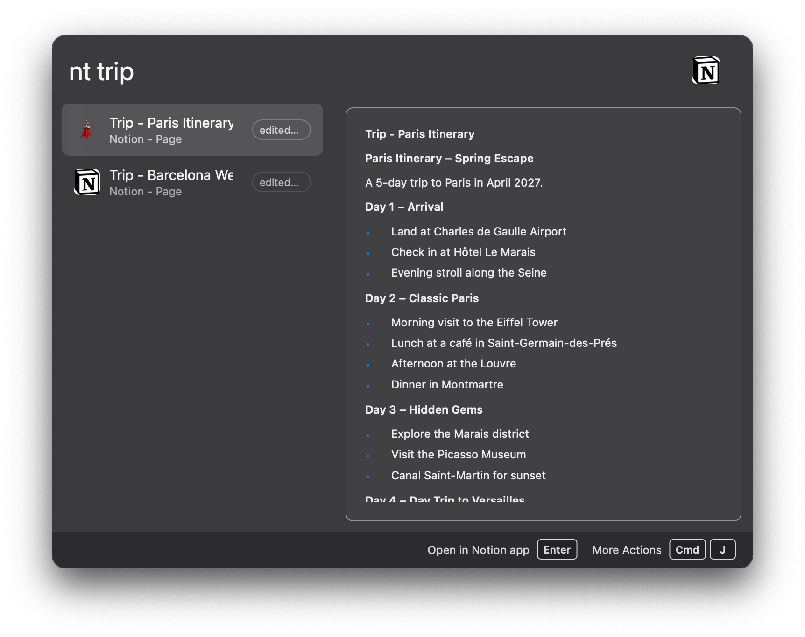

# wox-notion-plugin

[](https://github.com/lmgarret/wox-notion-plugin/actions/workflows/ci.yml)
[](LICENSE)

A [Notion](https://www.notion.so) plugin for [Wox launcher](https://github.com/Wox-launcher/Wox) 2.x: search your workspace, jump back to recent pages, and capture notes without leaving the keyboard.

## Features

| Query | What happens |
| --- | --- |
| `nt` | Your most recently edited pages |
| `nt <term>` | Search pages and databases shared with your integration |
| `nt add <text>` | Create a page titled `<text>` in your capture database |

Every page result offers three actions: open in the Notion desktop app (with browser fallback), open in the browser, and copy the page link. The default open target is configurable.




## Installation

1. Download the latest `.wox` file from the [releases page](https://github.com/lmgarret/wox-notion-plugin/releases).
2. Drop it onto the Wox window, or run `wpm install ./wox-notion-plugin.wox`.

Every release asset carries a [build provenance attestation](https://docs.github.com/actions/security-guides/using-artifact-attestations), so you can confirm it was built by this repository's CI from the tagged commit before installing it:

```sh
gh attestation verify wox-notion-plugin.wox --repo lmgarret/wox-notion-plugin
```

## Setup

The plugin talks to Notion through an *internal integration* — a personal API token scoped to the pages you choose:

1. Open [app.notion.com/developers/tokens](https://app.notion.com/developers/tokens) and create a new internal integration for your workspace. `Read content` and `Insert content` capabilities are enough.
2. Copy the integration secret.
3. In Notion, share the pages/databases you want to search with the integration: open a page → `···` → `Connections` → add your integration. Sub-pages inherit access.
4. In Wox: `Settings → Plugins → Notion`, paste the secret into **Integration token**.

### Quick capture

`nt add <text>` creates pages in one database of your choice (an inbox or tasks database works well):

1. Share that database with your integration (see above).
2. Copy the database link from Notion (`···` → `Copy link`).
3. Paste it into the **Capture database** setting — the plugin extracts the ID from the URL.

The captured text becomes the page title; refine it in Notion later.

## Development

Prerequisites: [Node.js ≥ 20](https://nodejs.org) (see `.nvmrc`) and [pnpm](https://pnpm.io).

```sh
pnpm install         # install dependencies + git hooks
pnpm dev             # rebuild dist/ on change
pnpm test            # unit tests (Vitest)
pnpm lint            # lint + format check (Biome)
pnpm typecheck       # TypeScript
pnpm package         # build and produce wox-notion-plugin.wox
```

`pnpm build` produces a complete plugin directory in `dist/` (bundled `index.js`, `plugin.json`, `images/`). To iterate against a real Wox instance, add `dist/` as a local plugin directory in Wox's dev settings and reload the plugin after rebuilds.

The stack: TypeScript, [tsup](https://tsup.egoist.dev) (single-file bundle — the installed plugin ships no `node_modules`), [Vitest](https://vitest.dev), [Biome](https://biomejs.dev), [`@wox-launcher/wox-plugin`](https://www.npmjs.com/package/@wox-launcher/wox-plugin) and [`@notionhq/client`](https://www.npmjs.com/package/@notionhq/client).

### Releases

Releases are automated with [release-please](https://github.com/googleapis/release-please): merge commits following [Conventional Commits](https://www.conventionalcommits.org) into `main`, and a release PR accumulates the changelog and version bumps (`package.json` and `plugin.json` stay in sync). Merging the release PR publishes a GitHub release with the `.wox` package attached.

The asset filename is unversioned (`wox-notion-plugin.wox`) so that the [Wox plugin store](https://github.com/Wox-launcher/Wox) manifest can point at a stable `releases/latest/download/` URL: the store's update bot refetches that URL every few hours and opens a PR bumping the published version.

## Contributing

See [CONTRIBUTING.md](CONTRIBUTING.md). Commit messages must follow Conventional Commits (enforced by a commit-msg hook).

## License

[GPL-3.0](LICENSE) — matching the Wox plugin SDK bundled into the distributed package.
